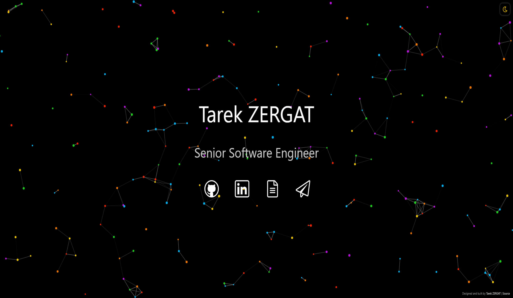

#  tarekzergat.github.io &middot;

 

I have designed this website to be simple and accessible. Dynamic particles create an experience that is interactive for visitors. The site offers two themes via a toggle, a dark theme (default) and a light theme. Once toggled, the selected theme should persist between tabs, windows, and page reloads.

Mobile support for the site ranges from 4 in. displays through 6.7 in. all the way up to 13 in. tablets.
